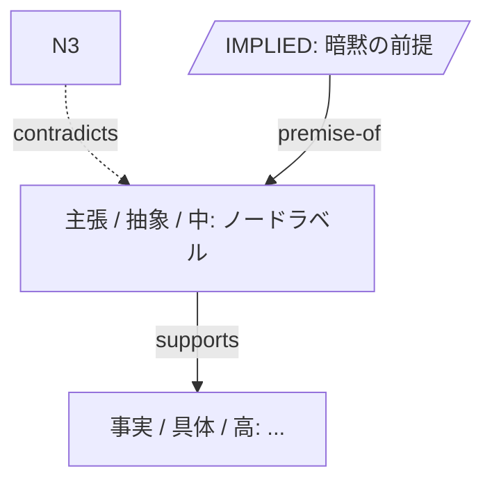

# Graph Think Map

散文や半整理の思考をグラフに変換し、論理を可視化して検証する。出力は Mermaid グラフ + ノード/エッジ表 + 検証レポート。

## ワークフロー

進捗チェックリストを応答にコピーして進捗を管理する:

```
- [ ] Step 1: 原子命題を抽出
- [ ] Step 2: 各ノードを分類 (type / abstraction / confidence)
- [ ] Step 3: 関係 (edges) を同定
- [ ] Step 4: 検証 (5 種類のチェック)
- [ ] Step 5: グラフ + レポートを出力
```

### Step 1: 原子命題を抽出

入力プロンプトを **これ以上分割すると意味が変わる最小単位の主張** に分解する。

- 1 文に複数主張があれば分ける
- 修辞・同じ趣旨の繰り返しは省く
- ユーザーの言い回しを尊重する。**意訳しすぎない** (重要)
- 入力に構造 (見出し・箇条書き) があればそれを足場として活かす

各命題に短い ID (`N1`, `N2`, ...) と短いラベル (~30 文字以内) を付ける。

### Step 2: ノードの分類

各ノードに 3 つの属性を付ける。

**type**:
- `主張` — 評価可能な命題
- `事実` — 検証済み・公知 (出典が示せるもの)
- `仮説` — 推測・未検証
- `定義` — 用語の定義
- `例` — 具体例・インスタンス
- `問い` — オープンな疑問

**abstraction** (抽象度):
- `抽象` — 一般原則、メタレベル
- `中間` — 中間的な一般化
- `具体` — 特定の事象・数値・固有名

**confidence** (確信度):
- `高` — 強い根拠あり
- `中` — そこそこの根拠
- `低` — 推測・予感

迷ったら **より弱い分類を選ぶ** (主張ではなく仮説、高ではなく中)。

### Step 3: 関係 (edges) を同定

ノード間の関係は以下の語彙のみから選ぶ。**自分で関係を発明しない**。

| ラベル | 意味 |
|--------|------|
| supports | A は B を裏付ける |
| contradicts | A は B と矛盾する |
| causes | A は B を引き起こす |
| contains | A は B を包含する (A が広いカテゴリ) |
| exemplifies | A は B の具体例 |
| premise-of | A は B の前提 |
| conclusion-of | A は B から導かれる結論 |
| analogy | A と B は類比 |

入力に明示されていない関係を **無理に作らない**。気づいた暗黙の関係は Step 4 で `IMPLIED-` ノードとして扱う。

### Step 4: 検証 (5 種類)

各検証で見つかった事項に `[high|med|low]` の severity を付けて列挙する。**問題が無い項目も「該当なし」と明示する** (透明性のため)。

1. **論理整合性**
   - `contradicts` edge の存在
   - 結論があるが前提が不足している
   - 循環論法 (A premise-of B premise-of A)

2. **具体抽象バランス**
   - 抽象主張に対して `exemplifies` edge が無い → 「裸の主張」 (high)
   - 具体例ばかりで `contains` で繋がる一般原則が無い → 「教訓欠如」
   - 抽象と具体が直接繋がっており中間が飛んでいる → 「論理ジャンプ」

3. **事実/仮説分離**
   - confidence「高」のノードに検証可能な根拠が示されていない → 「事実扱いの仮説」 (high)
   - `事実` ラベルなのに出典・検証手段が示されていない → 出典の提示を推奨

4. **暗黙の前提**
   - 結論に至るまでに明示されていない仮定がある場合、新ノード `IMPLIED-N1`, `IMPLIED-N2`, ... として追加し、グラフにも含める

5. **情報の欠落**
   - 反対意見・反証となりうる視点が触れられているか
   - 必要だが未定義の用語が無いか

### Step 5: 出力

下のテンプレートで出力する。**先頭に Summary と Mermaid を置く** ことで一目で構造が分かる。

````
## 概要
{1-2 文で「思考の主旨」を要約}

## グラフ (Mermaid)

> ※ Claude Code terminal では描画されないが、claude.ai / GitHub / IDE プレビュー等で開けばレンダリングされる。

## ノード一覧

| ID | ラベル | type | 抽象度 | 確信度 |
|----|--------|------|--------|--------|
| N1 | ...    | 主張 | 抽象   | 中     |

## 関係一覧

- N1 → supports → N2: {1 行で根拠}
- N3 ⇎ contradicts ⇎ N1: ...

## 検証レポート

### 1. 論理整合性
- [med] N3 と N5 が矛盾: {詳細}
- (該当なし)

### 2. 具体抽象バランス
- [high] N1 (抽象) に具体例が無い

### 3. 事実/仮説分離
- [high] N4 が「事実」だが出典が無い

### 4. 暗黙の前提
- IMPLIED-N1: 「{X} が前提とされているが明示されていない」

### 5. 情報の欠落
- [low] 反証となる視点 ({例}) が触れられていない

## 次の整理ステップ
1. {具体アクション}
2. {具体アクション}
````

### Mermaid 記法のヒント

- `graph TD` を default (主張は上から下に流れる)
- 実線 `-->` = supports / causes / contains / exemplifies / premise-of / conclusion-of
- 点線 `-.->` = contradicts / analogy (反対 or 弱い関係)
- `IMPLIED-` ノードは六角形 `IMPLIED_N1[/"..."/]` で視覚的に区別 (Mermaid ID にハイフン不可なのでアンダースコアに置換)
- ラベルは短く。詳細はノード一覧表に書く

## 出力スタイルの指針

- **元の言い回しを尊重する**: ノードラベルはユーザーの言葉を使う。意訳が必要なら原文を併記
- **問題ゼロのときも明示する**: 「矛盾なし」「前提も明示されている」と書く
- **severity を必ず付ける**: 全ての指摘に high / med / low
- **ノード数の目安は 30 以下**: 増えすぎる場合は粒度を上げてグループ化、または「{X} に関するクラスタ」としてサブグラフ化
- **入力が短い時は出力も短く**: 5 ノード以下ならノード一覧表を省略してエッジ一覧だけにしてよい

## やらないこと

- ユーザーの主張を勝手に修正・賛同・反論しない。**観察と検証** に徹する
- 出典のない「事実」を補完しない。URL を推測で生成しない
- 元プロンプトに無い意見を勝手に追加しない (暗黙の前提は `IMPLIED-` 接頭辞で明示するのみ)
- 「考えが浅い」「もっと深掘りすべき」のような価値判断を出力しない

## 品質チェックリスト

出力前にこのチェックリストを応答にコピーして自己確認する:

```
- [ ] すべてのノードに type / abstraction / confidence が付いている
- [ ] エッジは固定語彙 (supports / contradicts / ...) のみを使っている
- [ ] Mermaid 構文がシンタックスエラーにならない
- [ ] 5 種類の検証それぞれで「問題あり」or「該当なし」を明示した
- [ ] 全ての指摘に severity (high / med / low) が付いている
- [ ] 元プロンプトに無い意見を勝手に追加していない
- [ ] 暗黙の前提は IMPLIED- 接頭辞で明示している
- [ ] ノード数が 30 以下に収まっている (超えるなら粒度を上げる)
```
